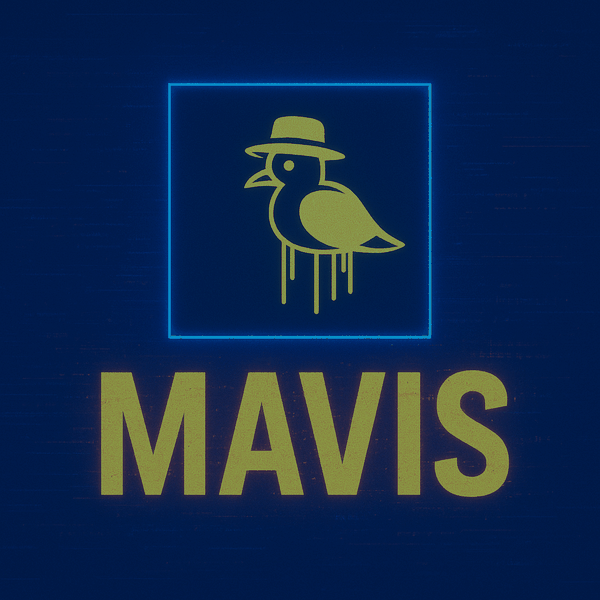

<div align="center">

<!-- Banner / Avatar -->


<br/>

<!-- Animated greeting -->
[](https://github.com/MAVIS-creator)

<!-- Profile Views -->


<!-- Connect Badges -->
[](https://x.com/Mavisgaming23)
[](https://github.com/MAVIS-creator)
[](mailto:mavisenquires@gmail.com)

</div>

---

## 💡 About Me

```yaml
name:       Mavis
alias:      MAVIS-creator
role:       Full-Stack Developer | Security Enthusiast | Gamer
location:   Online & in the Matrix
```

- 🏗 **Currently Building:**
  - 🎮 **Mavis Gaming Site** – Full dynamic PHP backend + admin panel
  - 🔐 **Blockchain-Based Attendance System** – Tamper-proof records with private blockchain
  - 🧠 **AI & Automation Bots** – Python-powered tools for real-world tasks
  - 📊 **CGPA Calculator & Academic Tools** – Python CLI/web utilities
  - 🌐 **Personal Portfolio** – Modern, animated personal brand site

- 📚 **Currently Learning:**
  - ⚛️ **React** – SPAs, hooks, state management
  - 🐍 **Advanced Python** – Flask, bots, automation, security tools
  - 🔐 **Cybersecurity** – Penetration testing, auth systems, data breach analysis
  - 🏛 **Laravel** – Advanced PHP architecture & APIs
  - 🟦 **TypeScript** – Type-safe modern JavaScript

- 🎮 **Fun Fact:** I debug 10x faster with gaming soundtracks blasting 🎧🔥

---

## 🛠 Tech Stack

<div align="center">

**Languages**


**Frameworks & Libraries**


**Databases**


**Tools & Platforms**


</div>

---

## 🚀 Featured Projects

<div align="center">

| 🗂 Project | 💬 Description | 🔧 Stack |
|---|---|---|
| [🎮 Mavis Gaming Site](https://github.com/MAVIS-creator/mavis) | Dynamic gaming platform with admin panel | PHP, MySQL, CSS |
| [🔐 Blockchain Attendance](https://github.com/MAVIS-creator/Blockchain-Based-Attendance-System) | Tamper-proof attendance with private blockchain | PHP, Blockchain |
| [🐍 Python Bots](https://github.com/MAVIS-creator/Python-bots) | Automation & utility bots | Python |
| [🔍 Data Breach Tool](https://github.com/MAVIS-creator/DataBreachTool) | Security research & breach analysis tool | Python |
| [🔒 Secure Login](https://github.com/MAVIS-creator/secure-login) | Hashed auth system with Flask | Python, Flask, HTML |
| [📂 File Classifier](https://github.com/MAVIS-creator/File-Classifier) | Automated file sorting & classification | Python |
| [🐍 Snake Game](https://github.com/MAVIS-creator/Snake-game) | Classic snake game in JavaScript | JavaScript |
| [📊 CGPA Calculator](https://github.com/MAVIS-creator/CGPA) | GPA calculation utility | Python |
| [🌍 Geo Fence](https://github.com/MAVIS-creator/geo_fence) | Location-based fencing system | PHP |
| [🎯 Quiz App](https://github.com/MAVIS-creator/Quiz-App) | Interactive quiz platform | PHP |

</div>

---

## 📊 GitHub Stats

<div align="center">


<br/>


</div>

---

## 🏆 GitHub Trophies

<div align="center">

[](https://github.com/ryo-ma/github-profile-trophy)

</div>

---

## 📈 Contribution Activity

<div align="center">

[](https://github.com/ashutosh00710/github-readme-activity-graph)

</div>

---

## 🐍 Contribution Snake

<div align="center">

<picture>
  <source media="(prefers-color-scheme: dark)" srcset="https://raw.githubusercontent.com/MAVIS-creator/MAVIS-creator/output/github-snake-dark.svg">
  <source media="(prefers-color-scheme: light)" srcset="https://raw.githubusercontent.com/MAVIS-creator/MAVIS-creator/output/github-snake.svg">
  
</picture>

</div>

---

<div align="center">

*"Code is not just logic — it's art, power, and identity."* 🔥

</div>
